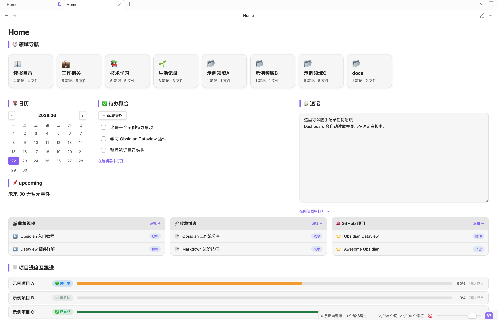

# 🏠 obsidian-dashboard

[English](README.en.md) | 中文

一个基于 Obsidian + Dataview 插件的**个人工作台 Dashboard**。无需额外插件（除 Dataview），纯 CSS + DataviewJS 实现，开箱即用。

> **功能完整** • **高度可定制** • **性能优化** • **中文支持**

## 预览效果



Dashboard 包含以下模块：

- **🧭 领域导航** — 按文件夹自动统计笔记数量，点击展开二级目录
- **📆 日历** — 交互式月历，点击日期创建/打开日记
- **✅ 待办聚合** — 集中管理待办事项，支持新增/完成/删除
- **📝 速记** — 随手记录想法，自动保存
- **📌 upcoming** — 自动从日记中提取未来事件
- **📋 项目进度及跟进** — 可视化进度条 + 状态标签
- **🎬🔗🐙 收藏三栏** — 收藏视频/博客/GitHub 项目（隐藏于收藏数据文件中维护）
- **✔️ 最近完成** — 已完成待办回顾
- **🕒 最近修改** — 最近编辑的笔记列表

## 安装步骤

### 1. 安装依赖插件

在 Obsidian 中安装社区插件 **Dataview**，并在设置中开启：
- ✅ Enable JavaScript Queries (启用 DataviewJS)
- ✅ Enable Inline JavaScript Queries

### 2. 复制文件到你的 Vault

将本项目中的文件按以下结构放入你的 Obsidian Vault 根目录：

```
你的Vault/
├── .obsidian/
│   └── snippets/
│       └── Dashboard.css          ← CSS 样式文件
├── 00 - Daily/                    ← 日记目录（日历模块使用）
├── Home.md                        ← Dashboard 主文件
├── ★★Todo.md                      ← 待办数据
├── ★★Quick Notes.md               ← 速记数据
├── ★★Project Progress.md          ← 项目进度数据
├── ★★Video Bookmarks.md           ← 视频收藏数据
├── ★★Blog Bookmarks.md            ← 博客收藏数据
└── ★★GitHub Bookmarks.md          ← GitHub 收藏数据
```

### 3. 关闭安全模式 & 安装 Dataview

1. 打开 Obsidian 设置 → 社区插件
2. **关闭「安全模式」**（否则无法使用社区插件和 DataviewJS）
3. 点击「浏览」搜索并安装 **Dataview**
4. 在 Dataview 设置中开启 **Enable JavaScript Queries**

### 4. 启用 CSS Snippet

1. 打开 Obsidian 设置 → 外观 → CSS 代码片段
2. 点击刷新按钮
3. 开启 `Dashboard` 样式

### 5. 自定义领域导航

编辑 `Home.md` 中的 `domains` 数组，将文件夹名替换为你自己的目录：

```javascript
const domains = [
  { name: "显示名称", icon: "📊", folder: "实际文件夹名" },
  // ... 添加更多
];
```

### 6. 设置默认阅读模式

Dashboard 依赖阅读模式渲染 DataviewJS，否则打开时会显示代码。

- **方式一（推荐）**：Home.md 的 frontmatter 中已包含 `obsidianUIMode: preview`，无需额外设置，该文件会自动以阅读模式打开。
- **方式二（全局）**：设置 → 编辑器 → 默认编辑模式 → 选择「阅读模式」，所有笔记默认以阅读模式打开，需编辑时按 `Cmd/Ctrl + E` 切换。

### 7. 设为首页（可选）

安装社区插件 **Homepage**，将启动页设为 `Home`。


## ✨ 功能特性

| 功能 | 本项目 | 其他 Dashboard 方案 |
|------|:-----:|:--:|
| 领域导航 | ✅ | - |
| 日历系统 | ✅ | - |
| 待办管理 | ✅ | ✅ |
| 进度可视化 | ✅ | - |
| 纯 CSS 实现 | ✅ | ❌ |
| 无需额外插件 | ✅ | ❌ |
| 中文支持 | ✅ | - |

## 🔧 依赖

**必需：**
- [Obsidian](https://obsidian.md) v1.0+
- [Dataview 插件](https://github.com/blacksmithgu/obsidian-dataview) v0.5+

**可选推荐：**
- [Homepage](https://github.com/miracles-dev/obsidian-homepage) — 设置首页
- [Editor Width Slider](https://github.com/MugishoMp/obsidian-editor-width-slider) — 调整编辑宽度

## 🆘 常见问题 (FAQ)

### Q: Dashboard 看不到内容 / 没有样式？
**A:** 确保：
1. Dataview 插件已安装并启用 JavaScript
2. Home.md frontmatter 设置了 `obsidianUIMode: preview`
3. **已在「设置 → 外观 → CSS 代码片段」中开启 `Dashboard` 样式**（最常被忽略的一步）
4. 没有其他样式冲突

### Q: 日历点击创建日记不工作？
**A:** 检查 `00 - Daily/` 文件夹是否存在，且 Home.md 中的日期路径配置正确。

### Q: 如何修改样式颜色？
**A:** 编辑 `.obsidian/snippets/Dashboard.css` 中的 CSS 变量：
```css
:root {
  --color-primary: #5e81ac;  /* 修改主色 */
  --color-accent: #bf616a;   /* 修改强调色 */
}
```

## 🚀 快速开始

**不想手动配置？** 按照这个快速流程：

> ⚠️ **重要**：除了安装 Dataview，还必须**额外**在 **设置 → 外观 → CSS 代码片段** 中开启 `Dashboard` 样式，否则 Dashboard 没有排版（只剩原始代码）。

```bash
# 1. Clone 项目
git clone https://github.com/your-username/obsidian-dashboard.git

# 2. 在 Obsidian 中打开该目录为 Vault

# 3. 安装 Dataview 插件，启用 JavaScript

# 4. 设置 → 外观 → CSS 代码片段 → 点击刷新 → 开启 Dashboard 样式

# 5. 打开 Home.md - Dashboard 即可使用！
```

## 📚 文档和资源

- 📖 [详细安装指南](./INSTALL.md) — 分步讲解
- 🔧 [高级自定义](./CUSTOMIZATION.md) — 深度定制教程
- 💬 [讨论社区](../../discussions) — 交流想法和问题
- 🐛 [报告 Bug](../../issues) — 提交问题

## 🤝 贡献

我们欢迎所有形式的贡献！详见 [贡献指南](CONTRIBUTING.md)。

## ☕ 支持项目

如果这个项目对你有帮助，你可以通过以下方式支持我们：

### 💝 捐赠

**支付宝** - 扫描下方二维码进行捐赠


> **⚠️ 免责声明**
>
> - 本项目为免费开源软件，捐赠**完全自愿**，无论是否捐赠均可完整使用全部功能。
> - 捐赠仅作为对作者的鼓励与支持，**不构成**任何商业服务、技术承诺或售后保障。
> - 请在自身经济能力范围内理性捐赠，任何金额我们都深表感谢。

你的支持将帮助我们：
- ✨ 开发新功能
- 🐛 修复更多 bug
- 📚 完善文档
- 💪 继续维护项目

### ⭐ 其他支持方式

- **Star 本仓库** - 帮助更多人发现这个项目
- **分享** - 向朋友推荐
- **贡献** - 提交代码或文档改进
- **反馈** - 提交 Issues 和建议

## 📜 许可证

MIT License - 详见 [LICENSE](LICENSE)

## ❤️ 致谢

感谢所有使用、反馈和贡献的人！

---

<div align="center">

**[⬆ 回到顶部](#-obsidian-dashboard)**

Made with ❤️ for Obsidian users

</div>
